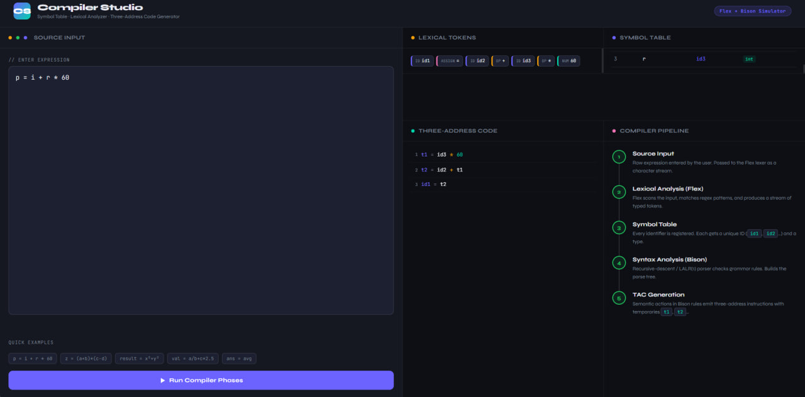

<!-- Banner -->
<div align="center">

  

  <br/>

  # LexiTAC - Symbol Table, Lexical Analysis & TAC Generation

  <br/>

  <!-- Badges -->
  
  
  
  
  

  <br/>

  <p>
    <b>A hands-on compiler front-end implementation for CSE314 — Compiler Design.</b><br/>
    Tokenize • Parse • Generate Three-Address Code — all from scratch.
  </p>

  <a href="#-quick-start">Quick Start</a> •
  <a href="#-features">Features</a> •
  <a href="#-example-output">Demo</a> •
  <a href="#-how-to-contribute">Contribute</a>

</div>

<br/>

---

## 📖 Overview

**LexiTac** is a modular compiler front-end built as part of the **CSE314 — Compiler Design** university course. It demonstrates the three core phases of compilation:

| Phase | Tool | What It Does |
|:------|:-----|:-------------|
| **Lexical Analysis** | Flex | Scans source code into a stream of classified tokens |
| **Syntax Parsing** | Bison | Validates grammar rules via LALR(1) parsing |
| **Code Generation** | C | Emits Three-Address Code (TAC) with temporaries |

A **Symbol Table** is maintained throughout, assigning each identifier a unique internal ID (`id1`, `id2`, …) and tracking its type.

> 💡 The project also includes an **interactive web-based simulator** (`LexiTAC.html`) — a beautiful dark-themed UI that visualizes all compiler phases in real time, right in your browser.

---

## ✨ Features

- 🔤 **Flex-based Lexer** — Regex-powered tokenization for identifiers, numbers, operators, and delimiters
- 🌳 **Bison-based Parser** — Full LALR(1) grammar with operator precedence (`+`, `-`, `*`, `/`, unary minus)
- 🗂️ **Symbol Table Manager** — Auto-registers identifiers with unique IDs and type tracking
- ⚡ **TAC Generator** — Emits clean three-address instructions during parse-tree traversal
- 🖥️ **Interactive Web Simulator** — Real-time visualization of Lexer → Symbol Table → Parser → TAC pipeline
- 🎨 **Colorized Terminal Output** — ANSI-colored CLI output with box-drawing characters (standalone C version)
- 🧪 **Quick Examples** — Pre-loaded expressions for instant testing
- 📐 **Modular Design** — Clean separation between lexer, parser, and code generation

---

## 🛠️ Tech Stack

<div align="center">

| Technology | Role | Version |
|:----------:|:----:|:-------:|
|  **C** | Core language | C11 |
| 🦊 **Flex** | Lexical analyzer generator | 2.6+ |
| 🦬 **Bison** | Parser generator (LALR) | 3.8+ |
|  **GCC** | Compiler | 11+ |
| 🌐 **HTML/CSS/JS** | Web simulator UI | ES6+ |
| 📦 **Make** | Build automation | GNU Make |

</div>

---

## 📁 Project Structure

```
LexiTAC/
│
├── 📄 lexer.l                  # Flex lexer — tokenization + symbol table
├── 📄 parser.y                 # Bison parser — grammar rules + TAC emission
├── 📄 Makefile                 # Build automation (make / make run / make clean)
├── 🌐 LexiTAC.html    # Interactive web-based compiler simulator
│
├── 📂 c_code/
│   ├── 📄 leci.c              # Standalone C implementation (no Flex/Bison)
│   └── 🔧 leci.exe            # Pre-compiled Windows binary
│
├── 📂 UI/
│   └── 🖼️ LexiTac_inteface.jpg # Web simulator UI screenshot
│
├── 📂 project-report/          # Course project report & documentation
│
└── 📄 README.md               # You are here!
```

---

## 🚀 Quick Start

### Prerequisites

Install the required tools:

```bash
# Debian / Ubuntu
sudo apt install flex bison gcc make

# macOS (Homebrew)
brew install flex bison gcc make

# Windows (MSYS2)
pacman -S flex bison gcc make
```

### Build & Run (Flex + Bison)

```bash
# Clone the repository
git clone https://github.com/mohammademon10/Compiler_Design_Project_LexiTAC.git
cd LexiTac

# Build the compiler
make

# Run with example input
make run

# Or run interactively
echo "p = i + r * 60" | ./compiler
```

### Run Standalone C Version (No Flex/Bison needed)

```bash
cd c_code
gcc leci.c -o leci
./leci
# Enter: v = a + b * 5
```

### Run Web Simulator

Simply open `LexiTAC.html` in any modern browser — no server required!

```bash
# Or from terminal:
open LexiTAC.html        # macOS
start LexiTAC.html       # Windows
xdg-open LexiTAC.html    # Linux
```

---

## 🎬 Example Output

### Terminal (Flex + Bison)

```
=============================================================================
         Flex + Bison: Symbol Table, Lexical Analysis & TAC Generator
=============================================================================
Enter expression(s). One per line. Ctrl-D to finish.
Example: p = i + r * 60

--- Lexical Tokens ---
<id1> <=> <id2> <+> <id3> <*> <NUMBER:60>

--- Three-Address Code (TAC) ---
t1 = id3 * 60
t2 = id2 + t1
id1 = t2

--- Symbol Table ---
Name            ID       Type
----            --       ----
p               id1      int
i               id2      int
r               id3      int
=============================================================================
```

### Web Simulator

<div align="center">
  
  <br/>
  <em>🖥️ Compiler Studio — Interactive Web-Based Compiler Simulator</em>
</div>

<br/>

The interactive UI provides a four-panel view:

| Panel | Description |
|:------|:------------|
| **Lexical Tokens** | Color-coded token chips with type labels (ID, NUM, OP, ASSIGN) |
| **Symbol Table** | Tabular view with #, Name, Internal ID, and Type columns |
| **Three-Address Code** | Line-numbered TAC with syntax highlighting |
| **Compiler Pipeline** | Animated step-by-step visualization of all 5 phases |

---

## 🧠 What I Learned

Through building LexiTac, I gained practical experience in:

- **Lexical Analysis** — How regex patterns (DFAs) tokenize raw source code into meaningful units
- **Parsing Theory** — LALR(1) grammars, shift-reduce parsing, and handling operator precedence & associativity
- **Symbol Table Design** — Managing identifier registration, scope tracking, and internal ID assignment
- **Intermediate Representations** — Generating Three-Address Code as a stepping stone toward machine code
- **Tool Proficiency** — Working with industry-standard tools (Flex / Bison) that power real compilers like GCC
- **Full-Stack Thinking** — Building a web-based visualizer to make abstract concepts tangible and interactive

---

## 🤝 How to Contribute

Contributions, issues, and feature requests are welcome! Here's how:

1. **Fork** the repository
2. **Create** a feature branch (`git checkout -b feature/amazing-feature`)
3. **Commit** your changes (`git commit -m 'Add amazing feature'`)
4. **Push** to the branch (`git push origin feature/amazing-feature`)
5. **Open** a Pull Request

### 💡 Ideas for Contributions

- [ ] Add support for `if-else` and `while` statements
- [ ] Implement boolean expressions (`&&`, `||`, `!`)
- [ ] Add function declarations and call expressions
- [ ] Build a parse-tree visualizer (SVG/Canvas)
- [ ] Add error-recovery modes to the parser
- [ ] Implement a basic optimizer for redundant TAC instructions

---

## 👤 Author & Contact

<div align="center">

| | |
|:--|:--|
| 👨‍💻 **Name** | Md.Emon Hossain |
| 🎓 **Course** | CSE314 — Compiler Design |
| 🐙 **GitHub** | [@mohammademon10](https://github.com/mohammademon10) |
| 📧 **Email** | emonemran677@gmail.com |

</div>

> 📬 Feel free to reach out for questions, collaborations, or just to say hi!

---

## 📜 License

This project is licensed under the **MIT License** — see the [LICENSE](LICENSE) file for details.

---

<div align="center">

  

  <br/>

  **If you found this helpful, please consider giving it a ⭐**

  It motivates me to build more awesome things! 🚀

  <br/>

  
  

</div>
